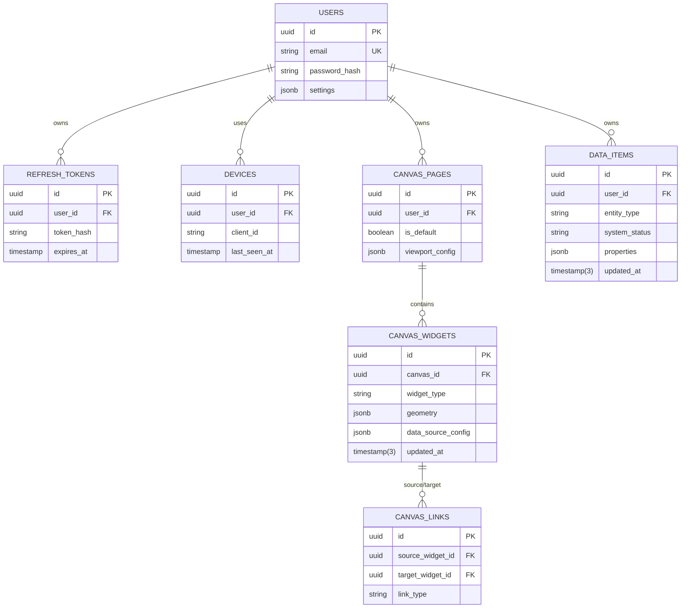

# Project Canvas GTD - 数据库设计文档 (v6.0)

**日期**: 2025-12-11
**数据库引擎**: PostgreSQL 15
**ORM 框架**: TypeORM
**核心设计**: Local-First 同步优化 (所有业务表均包含 Sync Metadata)

---

## 1. 实体关系图 (ER Diagram)

---

## 2. 表结构定义 (Table Definitions)

### 2.1 身份与安全 (Identity Domain)

#### `users` (用户表)
存储租户核心信息。

| 字段名 | 类型 | 约束 | 默认值 | 说明 |
| :--- | :--- | :--- | :--- | :--- |
| **id** | UUID | PK | `uuid_generate_v4()` | 主键 |
| **email** | VARCHAR | UK, NOT NULL | - | 登录邮箱 |
| **password_hash** | VARCHAR | NOT NULL | - | 加密密码 (Argon2) |
| **nickname** | VARCHAR | NULL | - | 昵称 |
| **avatar_url** | VARCHAR | NULL | - | 头像 URL |
| **settings** | JSONB | NOT NULL | `{}` | 用户全局设置 (主题等) |
| **is_active** | BOOLEAN | NOT NULL | `true` | 是否激活 |
| **last_login_at** | TIMESTAMP | NULL | - | 最后登录时间 |
| **created_at** | TIMESTAMP | NOT NULL | `NOW()` | 注册时间 |
| **updated_at** | TIMESTAMP | NOT NULL | `NOW()` | 更新时间 |

#### `refresh_tokens` (刷新令牌表)
用于 JWT 长效登录，支持多端会话管理。

| 字段名 | 类型 | 约束 | 默认值 | 说明 |
| :--- | :--- | :--- | :--- | :--- |
| **id** | UUID | PK | `uuid_generate_v4()` | 主键 |
| **user_id** | UUID | FK | - | 关联 `users.id` (CASCADE) |
| **token_hash** | VARCHAR | NOT NULL | - | Token 哈希值 (索引) |
| **expires_at** | TIMESTAMP | NOT NULL | - | 过期时间 |
| **is_revoked** | BOOLEAN | NOT NULL | `false` | 是否已撤销 (黑名单) |
| **device_info** | VARCHAR | NULL | - | 设备描述 (e.g. "Chrome 120 on Windows") |
| **created_ip** | VARCHAR | NULL | - | 创建 IP |

#### `devices` (设备审计表)
记录用户的所有同步客户端，用于安全审计和冲突调试。

| 字段名 | 类型 | 约束 | 默认值 | 说明 |
| :--- | :--- | :--- | :--- | :--- |
| **id** | UUID | PK | `uuid_generate_v4()` | 主键 |
| **user_id** | UUID | FK | - | 关联 `users.id` (CASCADE) |
| **client_id** | VARCHAR | NOT NULL | - | RxDB 生成的唯一 Client ID |
| **user_agent** | TEXT | NULL | - | User Agent |
| **platform** | VARCHAR | NULL | - | 平台 (web, ios, android) |
| **last_seen_at** | TIMESTAMP | NOT NULL | `NOW()` | 最后活跃时间 |
| **last_sync_ip** | VARCHAR | NULL | - | 最后同步 IP |

---

### 2.2 视图配置 (Canvas Domain)

#### `canvas_pages` (画布页面表)
目前设计为单画布，未来可扩展多页签。

| 字段名 | 类型 | 约束 | 默认值 | 说明 |
| :--- | :--- | :--- | :--- | :--- |
| **id** | UUID | PK | `uuid_generate_v4()` | 主键 |
| **user_id** | UUID | FK | - | 关联 `users.id` |
| **is_default** | BOOLEAN | NOT NULL | `false` | 是否为默认首页 |
| **viewport_config** | JSONB | NOT NULL | `{}` | 视口状态 (x, y, zoom) |
| **updated_at** | TIMESTAMP | NOT NULL | `NOW()` | 同步时间戳 |
| **deleted** | BOOLEAN | NOT NULL | `false` | 软删除标记 |

#### `canvas_widgets` (组件实例表)
画布上的核心元素（日历、列表、矩阵等）。

| 字段名 | 类型 | 约束 | 默认值 | 说明 |
| :--- | :--- | :--- | :--- | :--- |
| **id** | UUID | PK | `uuid_generate_v4()` | 主键 |
| **user_id** | UUID | NOT NULL | - | 租户隔离 (冗余字段优化查询) |
| **canvas_id** | UUID | FK | - | 关联 `canvas_pages.id` (CASCADE) |
| **group_id** | UUID | NULL | - | 分组 ID (用于同组组件通信) |
| **widget_type** | VARCHAR(30) | NOT NULL | - | 类型枚举 (calendar_master, smart_list...) |
| **geometry** | JSONB | NOT NULL | - | 物理属性 `{x, y, w, h, z}` |
| **data_source_config** | JSONB | NOT NULL | - | **核心**: 数据源配置 (过滤器/排序) |
| **view_state** | JSONB | NOT NULL | `{}` | 视图状态 (is_pinned, is_collapsed) |
| **updated_at** | TIMESTAMP(3) | NOT NULL | `NOW()` | 同步时间戳 (毫秒精度) |
| **deleted** | BOOLEAN | NOT NULL | `false` | 软删除标记 |

#### `canvas_links` (连接线表)
定义组件之间的数据流向。

| 字段名 | 类型 | 约束 | 默认值 | 说明 |
| :--- | :--- | :--- | :--- | :--- |
| **id** | UUID | PK | `uuid_generate_v4()` | 主键 |
| **user_id** | UUID | NOT NULL | - | 租户隔离 |
| **source_widget_id** | UUID | FK | - | 源组件 ID |
| **target_widget_id** | UUID | FK | - | 目标组件 ID |
| **link_type** | VARCHAR(20) | NOT NULL | `'context'` | 连接类型 |
| **updated_at** | TIMESTAMP(3) | NOT NULL | `NOW()` | 同步时间戳 (毫秒精度) |
| **deleted** | BOOLEAN | NOT NULL | `false` | 软删除标记 |

---

### 2.3 业务数据 (Business Domain)

#### `data_items` (通用数据项表)
所有 GTD 实体 (Task, Project, Event) 均存储于此，通过 `entity_type` 区分。

| 字段名 | 类型 | 约束 | 默认值 | 说明 |
| :--- | :--- | :--- | :--- | :--- |
| **id** | UUID | PK | `uuid_generate_v4()` | 主键 |
| **user_id** | UUID | NOT NULL | - | 租户隔离 |
| **entity_type** | VARCHAR(20) | NOT NULL | - | 枚举: `task`, `event`, `project` |
| **system_status** | VARCHAR(20) | NOT NULL | `'active'` | 状态: active, completed, archived... |
| **title** | TEXT | NULL | - | 标题 |
| **parent_id** | UUID | NULL | - | 父级 ID (Project/Event ID) |
| **do_date** | DATE | NULL | - | 计划执行日 (Soft Deadline) |
| **due_date** | TIMESTAMP | NULL | - | 截止时间 (Hard Deadline) |
| **start_time** | TIMESTAMP | NULL | - | 日程开始时间 |
| **end_time** | TIMESTAMP | NULL | - | 日程结束时间 |
| **is_all_day** | BOOLEAN | NOT NULL | `false` | 是否全天 (Client 字段) |
| **recurrence_rule** | TEXT | NULL | - | 重复规则 (iCal 字符串) |
| **original_event_id** | UUID | NULL | - | 重复事件的原始 ID |
| **properties** | JSONB | NOT NULL | `{}` | **扩展**: {priority, energy_level, content...} |
| **sort_order** | NUMERIC | NULL | - | 排序权重 (Lexorank) |
| **updated_at** | TIMESTAMP(3) | NOT NULL | `NOW()` | **Sync**: 同步时间戳 (毫秒精度) |
| **deleted** | BOOLEAN | NOT NULL | `false` | **Sync**: 软删除标记 |
| **created_at** | BIGINT | NULL | - | 创建时间戳 (Client 生成) |
| **completed_at** | BIGINT | NULL | - | 完成时间戳 (Client 生成) |

---

## 3. 索引设计 (Index Strategy)

为了优化 Local-First 的增量同步 (Incremental Sync) 和查询性能，设计了以下关键索引：

### 3.1 同步索引 (Sync Indexes)
所有支持同步的表 (`data_items`, `canvas_widgets`, `canvas_links`, `canvas_pages`) 必须包含此复合索引，用于高效的基于游标的拉取 (Cursor-based Pull)。

*   **定义**: `(user_id, updated_at, id)`
*   **用途**: `WHERE user_id = ? AND updated_at > ? ORDER BY updated_at ASC, id ASC`
*   **覆盖**: `data_items`, `canvas_widgets`, `canvas_links`

### 3.2 业务查询索引 (Query Indexes)
*   **`data_items`**:
    *   `idx_data_items_parent`: `(parent_id)` - 用于快速查找项目下的所有子任务。
    *   `idx_data_items_status`: `(system_status)` - 用于快速过滤活跃任务或归档项。

*   **`canvas_widgets`**:
    *   `idx_widgets_canvas`: `(canvas_id)` - 加载画布时快速拉取所有组件。

*   **`canvas_links`**:
    *   `idx_links_source`: `(source_widget_id)` - 查找下游组件。
    *   `idx_links_target`: `(target_widget_id)` - 查找上游组件。

*   **`devices`**:
    *   `unique_client`: `(user_id, client_id)` [UNIQUE] - 保证每个端 ID 唯一。

---

## 4. 外键策略 (Foreign Key Strategy)

*   **级联删除 (CASCADE)**:
    *   `canvas_widgets` -> `canvas_page`: 删除页面时自动清理组件。
    *   `refresh_tokens`, `devices` -> `user`: 删除用户时清理安全凭证。

*   **软关联 (No Foreign Key Constraint)**:
    *   `data_items.parent_id`: 虽然逻辑上指向自身 (Project->Task)，但数据库层面不设强外键约束。原因是在分布式的 Local-First 环境下，子任务可能比父项目先同步到达服务器，强约束会导致同步失败。
    *   应用层需处理“孤儿数据” (Orphaned Data)。
