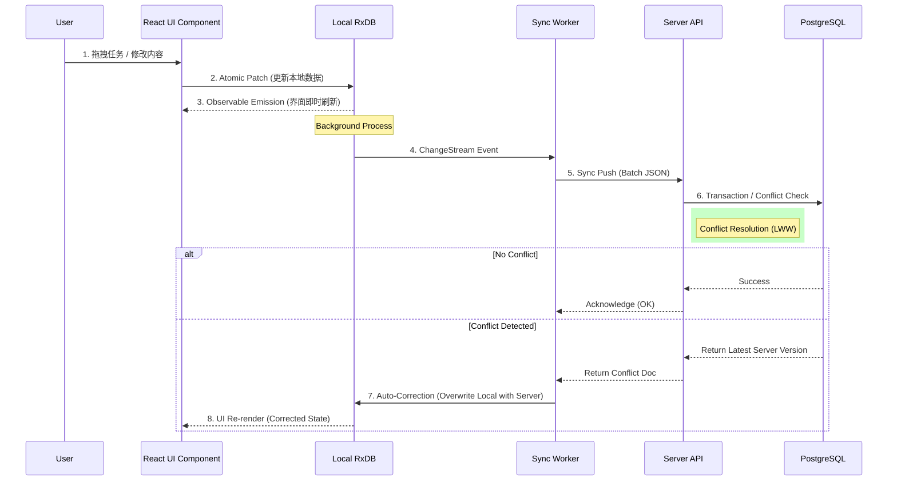
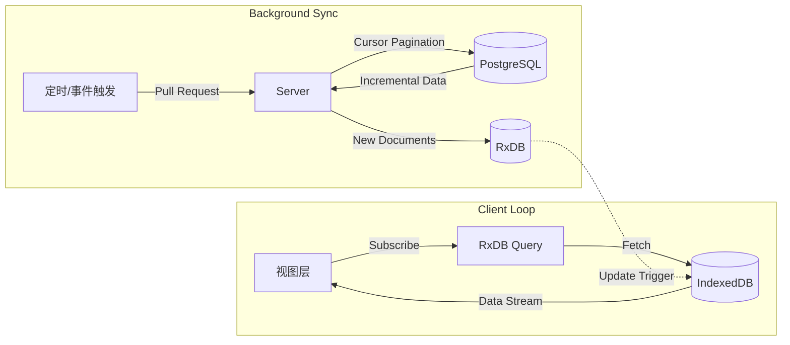

# Project Canvas GTD - Technical Architecture (v6.0)

**版本**: 6.0
**日期**: 2025-12-11
**架构模式**: Local-First (Offline-First)

---

## 1. 技术选型 (Technology Stack)

本项目采用现代化的全栈 TypeScript 架构，核心围绕 **Local-First** 理念构建，确保极致的响应速度和离线可用性。

### 1.1 前端 (Client)
负责应用交互、本地数据持久化及业务逻辑呈现。

*   **Core Framework**: [React 18](https://react.dev/) + [TypeScript](https://www.typescriptlang.org/)
*   **Build Tool**: [Vite](https://vitejs.dev/) (极速构建与 HMR)
*   **Local Database**: [RxDB](https://rxdb.info/)
    *   *Storage Adapter*: IndexedDB (via `rxdb-adapter-indexeddb`)
    *   *Sync*: Replication Protocol (Custom HTTP)
*   **State Management**: RxDB (作为单一数据源) + React Context
*   **UI System**:
    *   *Styling*: [TailwindCSS](https://tailwindcss.com/)
    *   *Icons*: Lucide React
*   **Canvas & Interaction**:
    *   *Drag & Drop*: `@dnd-kit/core`
    *   *Infinite Canvas*: `react-zoom-pan-pinch`
    *   *Resizable/Draggable Widgets*: `react-rnd`

### 1.2 后端 (Server)
负责身份验证、数据备份、多端同步裁决及定时任务。

*   **Framework**: [NestJS](https://nestjs.com/) (Modular Architecture)
*   **Language**: TypeScript
*   **Database ORM**: [TypeORM](https://typeorm.io/)
*   **Authentication**: Passport + JWT (Access/Refresh Token)
*   **API Protocol**: RESTful API (JSON)

### 1.3 数据库 (Database)
*   **Server Core**: [PostgreSQL 15](https://www.postgresql.org/)
    *   *Reason*: 强大的关系数据一致性保证，支持复杂的 SQL 查询（用于归档检索和统计），JSONB 字段支持灵活的 Schema 扩展。
*   **Client Core**: IndexedDB (Browser Native)
    *   *Reason*: 浏览器端性能最好的持久化存储，支持大量数据存储。

### 1.4 基础设施 (Infrastructure)
*   **Containerization**: [Docker](https://www.docker.com/) + Docker Compose
*   **Reverse Proxy**: Nginx (处理静态资源服务与 API 转发)
*   **Monorepo Manager**: Turborepo (高效管理 apps/packages 依赖与构建缓存)

---

## 2. 系统拓扑图 (System Topology)

本系统采用经典的 Client-Server 物理架构，但在逻辑上是去中心化的数据分布（每个 Client 都有完整数据副本）。

```mermaid
graph TD
    subgraph "Client Side (Browser / PWA)"
        UI[React UI Layer]
        Logic[Business Logic]
        RxDB[(Local RxDB\nIndexedDB)]
        
        UI <--> Logic
        Logic <--> RxDB
    end

    subgraph "Edge Layer"
        Nginx[Nginx Proxy\n(Port 80)]
    end

    subgraph "Server Side (Docker Network)"
        Nest[NestJS API Server\n(Port 3000)]
        Postgres[(PostgreSQL DB\nPort 5432)]

        Nest <--> Postgres
    end

    %% Network Flows
    RxDB -- "Sync (Pull/Push)" --> Nginx
    Nginx -- "Proxy /api/*" --> Nest
    UI -- "Static Assets" --> Nginx
```

---

## 3. 数据流向图 (Data Flow)

在 Local-First 架构中，读写分离是核心特征：**“读”总是本地的，“写”是乐观更新 (Optimistic UI)**。

### 3.1 写入流程 (Write Flow)
用户操作立即反映在界面上，后台异步完成网络同步。



### 3.2 读取流程 (Read Flow)
绝大多数读取直接查询 IndexedDB，无需网络请求。



---

## 4. Local-First 同步协议设计

同步引擎是本系统的“心脏”，由 `BatchSyncManager` (前端) 和 `SyncService` (后端) 组成。

### 4.1 核心原则
1.  **Cursor-based Pull (基于游标的拉取)**: 客户端只需请求“上次同步之后变更的数据”。
2.  **Batch Push (批量推送)**: 将短时间内的多次本地写入合并为一个 HTTP 请求，减少网络开销。
3.  **Last-Write-Wins (LWW, 最后写入者胜)**: 冲突解决策略。基于 `updated_at` 时间戳（毫秒精度）。

### 4.2 协议细节

#### A. 下行同步 (Pull)
*   **Trigger**: 应用启动、网络重连、定时间隔、Push 成功后。
*   **Request**: `GET /api/sync/:collection/pull`
    *   Parameters:
        *   `checkpoint_time`: 上次收到的最后一条数据的 `updated_at`。
        *   `checkpoint_id`: Last ID (用于时间戳相同时的 Tie-breaking)。
        *   `limit`: 批次大小 (e.g., 50)。
*   **Response**:
    *   `documents`: 变更记录数组（包含 `is_deleted` 标记的删除记录）。
    *   `checkpoint`: 新的游标。
    *   `hasMore`: 是否还有后续数据。

#### B. 上行同步 (Push)
*   **Trigger**: 本地数据变更后，经 `Debounce (50ms)` 缓冲触发。
*   **Request**: `POST /api/sync/batch/push`
*   **Payload Structure**:
    ```json
    {
      "items": [ ... ],   // changed tasks/events
      "widgets": [ ... ], // changed UI layouts
      "links": [ ... ],   // changed connections
      "pages": [ ... ]    // changed page meta
    }
    ```
*   **Transactional Safety**: 服务端在一个数据库事务中处理整个 Batch，保证数据一致性（特别是 Widget 和 Link 的关联一致性）。

### 4.3 冲突解决 (Conflict Resolution)
服务端是最终真理 (Source of Truth)。

*   **逻辑**: 当 `Client.updated_at < Server.updated_at` 时，视为冲突。
*   **处理**: 服务端拒绝写入，并返回服务端当前的最新版本数据。
*   **客户端修正**:RxDB 接收到冲突响应后，自动将本地数据回滚/更新为服务端版本，UI 随之跳变修正。

---

## 5. 数据库 Schema 设计概览

系统数据被严格隔离为“业务数据”与“视图配置”。

### 5.1 业务数据 (Business Domain)
*   **`data_items`**: 核心实体表。
    *   存储 Task, Project, Event。
    *   特点：使用 `properties` (JSONB) 存储非结构化属性（如标签、MD内容），`recurrence_rule` 存储 iCal 规则。

### 5.2 视图配置 (Canvas Domain)
*   **`canvas_pages`**: 画布页面容器。
*   **`canvas_widgets`**: 组件实例。
    *   核心字段 `data_source_config` (JSONB) 定义了组件“看”什么数据（过滤器、排序）。
    *   核心字段 `geometry` (JSONB) 定义物理位置。
*   **`canvas_links`**: 组件间的逻辑连线。
    *   定义了数据和信号如何在组件间流转。

### 5.3 身份与安全 (Identity Domain)
*   **`users`**: 租户信息。
*   **`refresh_tokens`**: 长期会话凭证。
*   **`devices`**: 设备审计日志。

---

## 6. 扩展性与性能优化

1.  **索引优化**:
    *   所有同步表均建立 `(user_id, updated_at, id)` 复合索引，确保 Pull 查询为 `O(log N)` 复杂度。
2.  **冷热分离**:
    *   活跃数据 (`active`) 全量同步到本地。
    *   归档数据 (`archived`) 仅存储于服务端，通过 Search API 按需加载（Lazy Loading），避免客户端 IndexedDB 膨胀。
3.  **静态资源缓存**:
    *   Nginx 配置强缓存策略，配合 Vite 的 Content Hash 文件名，实现加载性能最大化。
